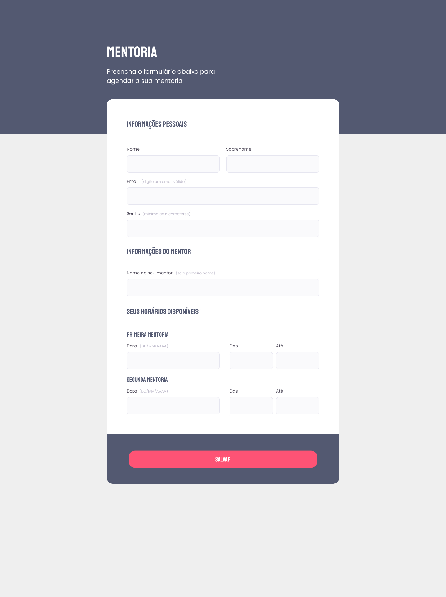

<h1 align="center">Creating a Form</h1>

<strong>PT-BR</strong>: Criando um Formulário

 

## 🚀 Technologies 
<strong>EN:</strong> This project was developed with the following technologies:

-----
<strong>PT-BR:</strong> Esse projeto foi desenvolvido com as seguintes tecnologias:

- HTML e CSS
- Git e Github
- Figma

 

## 📖 Project
<strong>EN:</strong> Project made in Rocketseat's course "Explorer".
Creating the page of a form with 3 sections and data validation, based on the layout sent via Figma.

----
<strong>PT-BR:</strong> Com base nos conhecimentos passados em aula, foi solicitada a criação da página contendo um formulário com 3 seções e validação de dados nos campos de preenchimento. O layout para consulta foi enviado através da plataforma Figma.
Projeto feito no curso Explorer da Rocketseat
 
 
- Online project: https://lidiabrentano.github.io/creating-a-form-01/
 

-----

By Lídia Brentano
